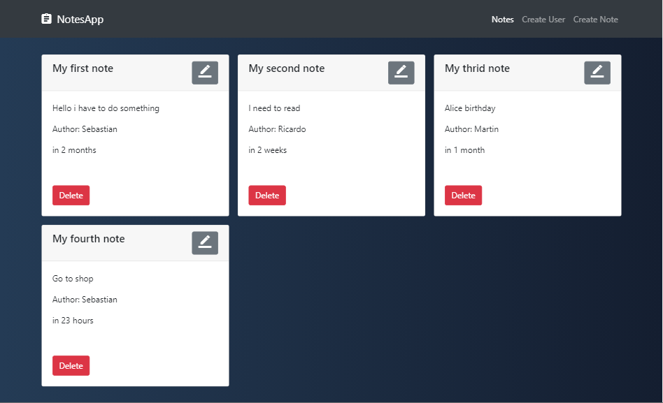

# Weather App
This is a very simple CRUD made with MERN stack, you can create,update,delete notes and users

# Live Demo
Visit live demo at <https://sebastianlabadie.github.io/CRUD-MERN/>



### Install Dependencies
```sh
$ npm install 
```

### Build the project
```sh
$ npm run build
```